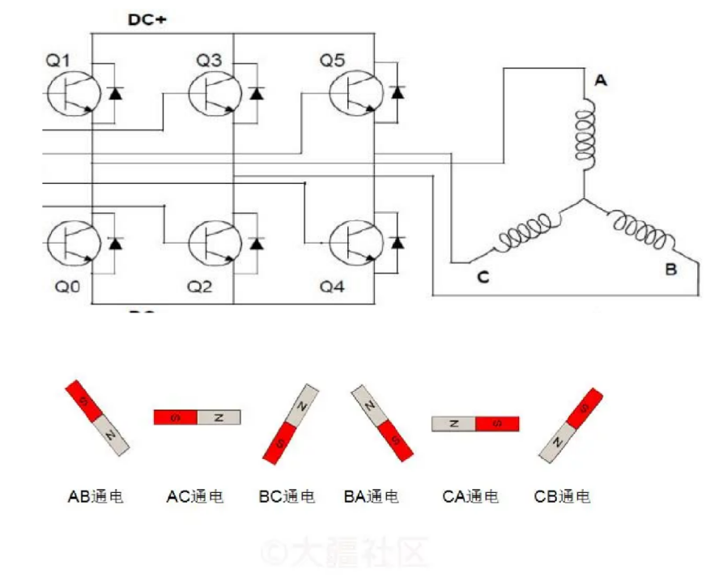
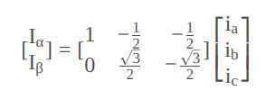
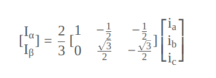
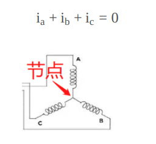
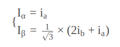
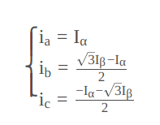
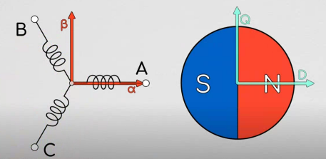
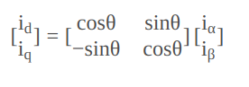

## FOC控制算法

### 介绍

**FOC（Field-Oriented Control）**，也被称作**矢量控制**。FOC是一种对无刷电机的驱动控制方法，它可以让我们对无刷电机进行 **“像素级”** 控制，实现很多传统电机控制方法所无法达到的效果。

```c
因为所谓的“矢量控制”其实就是在做解耦，把相互耦合的三相磁链解耦为容易控制的交轴Iq和直轴Id整个过程。
```

```c
无刷电机跟有刷电机的区别, 顾名思义就是无刷电机没有了有刷电机里的电刷。因此它不能够如同有刷电机那样采用机械结构就可以进行电流的换向， 而是必须通过采用如MOS这样的器件实现电子换向，MOS本质上就是可以理解为一种开关，可以像水龙头控制水流通断一样控制电流通断。
```




**FOC控制算法，FOC控制就是一种对电机运动模型进行抽象化和简化，进而有规律控制各个MOS管开关和通断的过程**。


### 控制过程


所谓FOC的过程，其实就是输入需求的电机力矩，最后得到对应的真实世界电机输出力矩的过程，如上图所示。而其中最核心的数学过程，就是**帕克逆变换和克拉克逆变换**，而这两个变换的数学公式上图中框图上面的公式所示，其中帕克变换可以对用户输入的**Iq**进行变换，根据电角度算出**Iα和Iβ**，接着，通过克拉克逆变换，三相电流**ia,ib,ic**能够被求出，最后这三个ia,ib,ic能够用作控制指令输入到电机控制器硬件中进行电机的控制。

#### 克拉克（Clarke）变换

```c
它的思路其实特别的简单，第一就是把三相随时间变换的，相位差为120°的电流波形抽象化为三个间隔120°的矢量。
第二就是利用三角函数对矢量进行降维，降维到两个坐标轴，从此复杂的三相变化问题就降解为了α-β坐标轴的坐标上的数值变化问题。
```


经过投影计算，我们可以得到Iα，Iβ的值，下面是它的矩阵表达形式



##### 等幅值形式

上面的步骤都很简单，但是我们会发现，往往最终论文或者资料上克拉克变换的体现形式都不是上面这样子，而是会加上一个系数，如2/3（等幅值变换系数），**目的是让Ia = Iα**



再结合基尔霍夫定律，可以消去Ic，我们并不需要知道所有三相电流，我们只需要知道两相电流就能够求解得到另外一相的电流，反映在硬件上，**我们就可以省去一路的电流传感器！节省了成本！**





##### 克拉克逆变换

我们再利用基尔霍夫定律，可以推导出克拉克逆变换



到这里，我们就可以通过这个这个静态电机模型计算得到三相电流了。但是要控制实际电机的转到，我们还需要对电机的动态模型进行建模，从而实现动态控制


#### 帕克（Park）变换

有了克拉克变换，我们只要知道**使得电机旋转**的Iα和Iβ电流输入规律，这样就能完美控制电机了。**帕克变换**就是能够帮助我们求得各种旋转情况下的Iα和Iβ的一个**电机旋转模型**。

帕克在我们刚刚固定在电机定子上的Iα−Iβ坐标系上，另外新建了一个坐标系，我们称之为Iq−Id坐标系，这个坐标系是可以随电机转子转动的，它与电机转子固联。如下图



其中，Iq−Id坐标系随转子转动，D轴在此处设定为指向电机的N级，Iq−Id坐标系因转动而造成的与Iα−Iβ坐标系的差角θ，就被称为电角度。


这里通过一个θ角来确定两个坐标系的旋转关系，类似与TF，我们只需要求得两个坐标系的旋转矩阵，就能将对应的电流值进行相应的转换。故得到映射关系如下：



##### 帕克逆变换

故由映射关系可以求得帕克逆变换如下：


实际的FOC应用中，**电角度是实时由编码器求出的**，因此是已知的。Iq和Id可以合成一个矢量，加上电角度（旋转）的存在，因此可以看成一个旋转的矢量。在通过Iq,Id和电角度求得Iα和Iβ后，我们就可以通过前面提到的克拉克逆变换求得ia,ib,ic的波形，这正是FOC的基本过程！

**==通常在简单的FOC应用中，我们只需要控制Iq的电流大小，而把Id设置为0==**。此时，Iq的大小**==（通常设为一个合适的常数）==**间接就决定了定子三相电流的大小，进而决定了定子产生磁场的强度。进一步我们可以说，它决定了电机产生的力矩大小！

Iq是旋转的矢量，同时Iq又会间接影响磁场的强度，这正是FOC的名称**磁场定向控制**的由来。


### 算法实现

[参考](http://dengfoc.com/#/dengfoc/%E7%81%AF%E5%93%A5%E6%89%8B%E6%8A%8A%E6%89%8B%E6%95%99%E4%BD%A0%E5%86%99FOC%E7%AE%97%E6%B3%95/4%E5%BA%8FFOC%E5%BC%80%E7%8E%AF%E9%80%9F%E5%BA%A6%E4%BB%A3%E7%A0%81%E7%9A%84%E6%92%B0%E5%86%99)