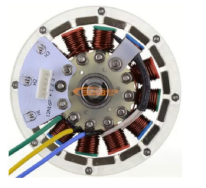
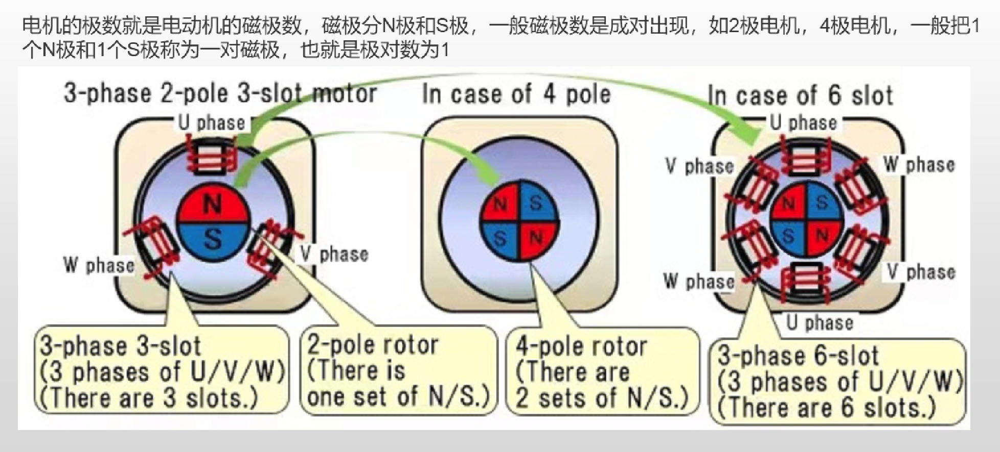
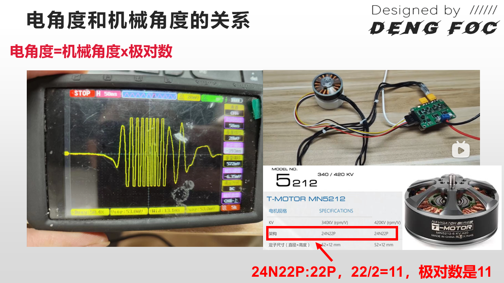

## 概念

> 这里将会对Foc算法中所出现的一些专有名词的进行解释

[参考](http://dengfoc.com/#/dengfoc/%E7%81%AF%E5%93%A5%E6%89%8B%E6%8A%8A%E6%89%8B%E6%95%99%E4%BD%A0%E5%86%99FOC%E7%AE%97%E6%B3%95/4.2FOC%E5%BC%80%E7%8E%AF%E9%80%9F%E5%BA%A6%E4%BB%A3%E7%A0%81%E7%9A%84%E5%8E%9F%E7%90%86%E6%95%99%E5%AD%A6)

### 介绍

首先，在学会怎么控制无刷电机前，我们需要对无刷电机的结构有基本的认识，基本的航模无刷电机结构图如下图所示，分为前盖，中盖，后盖，磁铁，硅钢片，漆包线、轴承和转轴组成。更加宏观上分，我们也可以直接把电机分为定子部分和转子部分。

#### 定子和转子

- **定子**就是有线圈绕组，固定不动的部分；
- **转子**就是电机旋转的部分，用于输出电机的转动和扭矩。

**直流无刷电机的驱动**，就是依靠改变电机定子线圈的电流交变频率和波形, 在定子周围形成磁场, 驱动转子永磁体转动, 进而带动电机转起来。

#### 磁极和磁极对数

> 电机的转子上通常会安装一块磁铁，这块磁铁由有多个永磁体串联组成

- **极**指的是永磁体磁场在转子上的分布，比如N极，S极。
- **磁极数**指的是转子上的**极**数量。
- **磁极极对数**指的是**磁极数的两倍**

- 电机有三相（U,V,W），并且绕组是3的倍数，数值上等于**磁极极对数 x 3**

#### 电角度和机械角度

- **机械角度**：转子旋转一周的角度，固定为360度。

- **电角度**：在机械角度旋转一周所形成的n个发电周期内，定子中某个绕组（某一相）中感应电动势的相位角。

- **电角度=机械角度x极对数**

我们的旋转角度编码器就是实际上测的就是电角度

