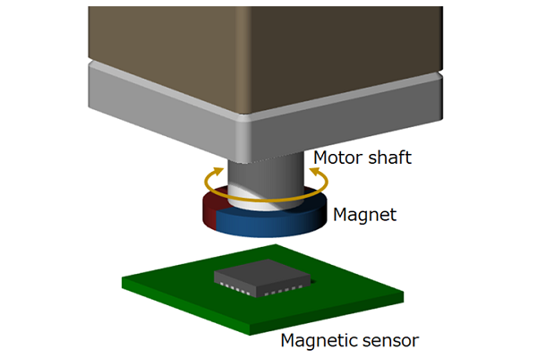
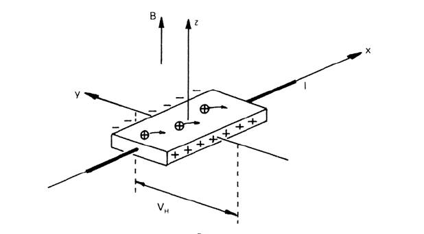
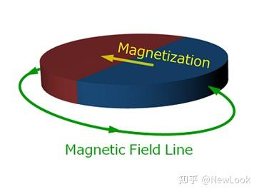
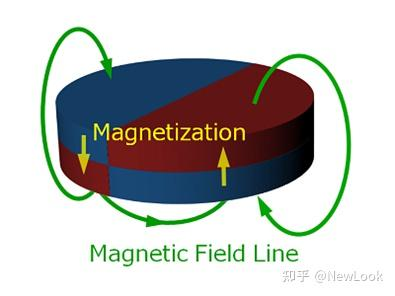
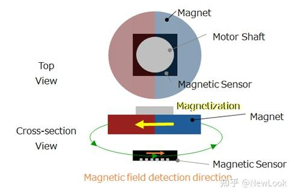
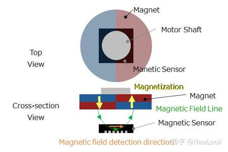
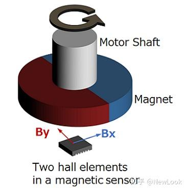
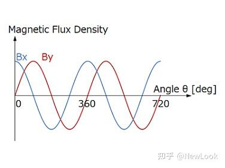
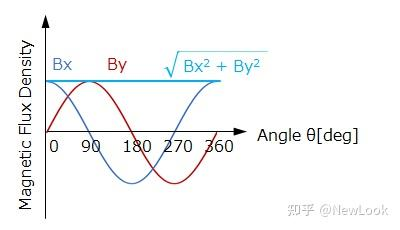
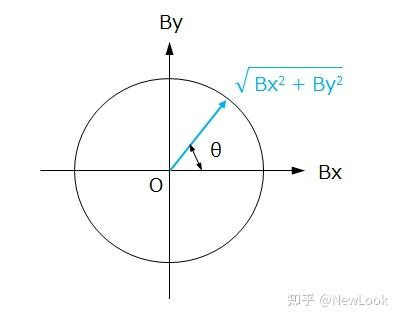

## 硬件

[参考](https://wjrsbu.smartapps.cn/pages/article/index?id=672922608&isShared=1&_swebfr=1&_swebFromHost=vivobrowser)

### 组成

调试Foc时，通常要找一个电机（最好是直驱的，避免减速箱带来的误差），然后在电机的转子上装上一块永磁体，然后设计一块带有磁编码器的PCB板，将磁编码器对着电机的转子安装，然后再连接上一个主控，供电后就可以进行调试了。




### 相关概念

#### 磁性编码器

磁性编码器通过检测**磁场变化**获得位置信息，并将其转换为**电信号**输出。

**旋转角度传感器IC**由**磁性传感器、AD转换器和运算电路的电子元件**组成，旋转角度传感器IC和永磁体可以组装出简单的小型磁性编码器。

最简单的磁性编码器是由**永磁体和磁传感器**构成的。永磁体安装在电机轴等旋转体的顶端，磁传感器安装在永磁体磁场范围内的PCB板上。安装在电机轴上的**永磁体**一旦开始**旋转**，磁传感器就能检测到磁场方向的变化，因此可以得出电机的**旋转位置**和**旋转速度**。

**磁性传感器**是里面有**霍尔元件**，由霍尔效应可知，当通有一定电流一块导体，在另一个方向上通过磁场时，它会在垂直I-B平面上产生一个电压，而我们的传感器将其电压进行编码输出，我们就能得到电机对应的旋转位置和旋转速度。霍尔元件分为检测纵向磁场强度和检测横向磁场强度的两种类型。



#### 永磁体

磁性编码器上使用的永磁体一般是圆盘形的（类似硬币），在圆盘的径向或轴向方向充磁。只要满足编码器工作所需的磁感应强度，就可以自由选择磁铁的材料和尺寸。





#### 永磁体和霍尔元件之间的安装方式

磁性编码器的理想状态是旋转轴、永磁体及霍尔元件的中心在同一直线上。这样的安装方式被称为**轴端安装**。轴端安装也会存在“轴偏心”的细微安装误差。

一旦出现轴偏心，霍尔元件检测到的磁场强度就会发生变化，进而导致检测的角度精度出现误差。要彻底消除轴偏心是非常困难的。在轴端安装下，如果将霍尔元件安装在**横向磁场**均匀的区域内，那么即使存在轴偏心，输入磁场强度也不会有太大变化。

因此，与检测纵向磁场强度的霍尔元件相比，检测横向磁场强度的霍尔元件可以**减小轴偏心对角度误差**的影响。



有时会选择轴向充磁永磁体来减弱侧面的漏磁，从而**降低侧面漏磁**对周围设备造成的不良影响，但是与径向充磁永磁体相比，轴向充磁永磁体的磁场区域更小，因此轴偏心导致的**角度误差相对更大**。



所以对比下来，不考虑对周围设备的影响时，最好选用轴向安装，减少测量的角度差。

```c
为什么这些类型的电机买回来使用时，首先需要先给电机校准一次呢？
- 因为不管什么安装方式，都会存在安装误差，这是不可避免的，校准一次是为了利用算法计算一个补偿值，
  补偿到测量值上减小误差。
- 如果平时拆装电机时，没有改变转子与编码器的相对安装位置，那么就不需要校准，否则需要重新校准一次。
```


### 磁性编码器的工作原理

**电机轴旋转**时，安装在轴端的**永磁体**所产生的磁场也会**旋转**，而在旋转轴的中心区域，旋转磁场保持一定的强度不变。霍尔元件检测该磁场分布变化，将其转换成电信号。由于霍尔元件只能检测单一方向的磁场强度，为了检测旋转位置，需要分别检测旋转磁场X轴方向磁场强度（Bx）和Y轴方向磁场强度（By）的霍尔元件。





将霍尔元件的电信号转换成角度信息，两个方向合成一个方向



霍尔元件将X轴和Y轴的磁场信息转换为电信号，然后由AD转换器转换成数字信号后发送到运算电路，再使用三角函数换算成角度信息，由相互正交的X轴分量和Y轴分量合成的平面图形称为里萨如图形。在没有轴偏心的轴端安装下，磁场强度保持不变且不停旋转，可以得出规则的正圆形利萨如图形，使用三角函数换算后的输出角度误差为零。此外，即使检测横向磁场强度的霍尔元件存在轴偏心，由于输入磁场几乎没有变化，所以输出的角度误差较小。



假设X轴为Bx，Y轴为By，通过**arctan（By/Bx）**计算能得出**旋转角θ**的绝对角度，角度信息可以通过绝对式输出。磁性编码器从本质上来说是检测绝对角度的编码器，如果将绝对角度转换成A相B相Z相信息，也可以作为脉冲信号通过增量式输出。如果绝对角度信息的分辨率足够高（可以通过编码器倍频来实现），则可以输出360ppr（每转脉冲数）、1000ppr、2500ppr、4000ppr等任意分辨率的脉冲信号。