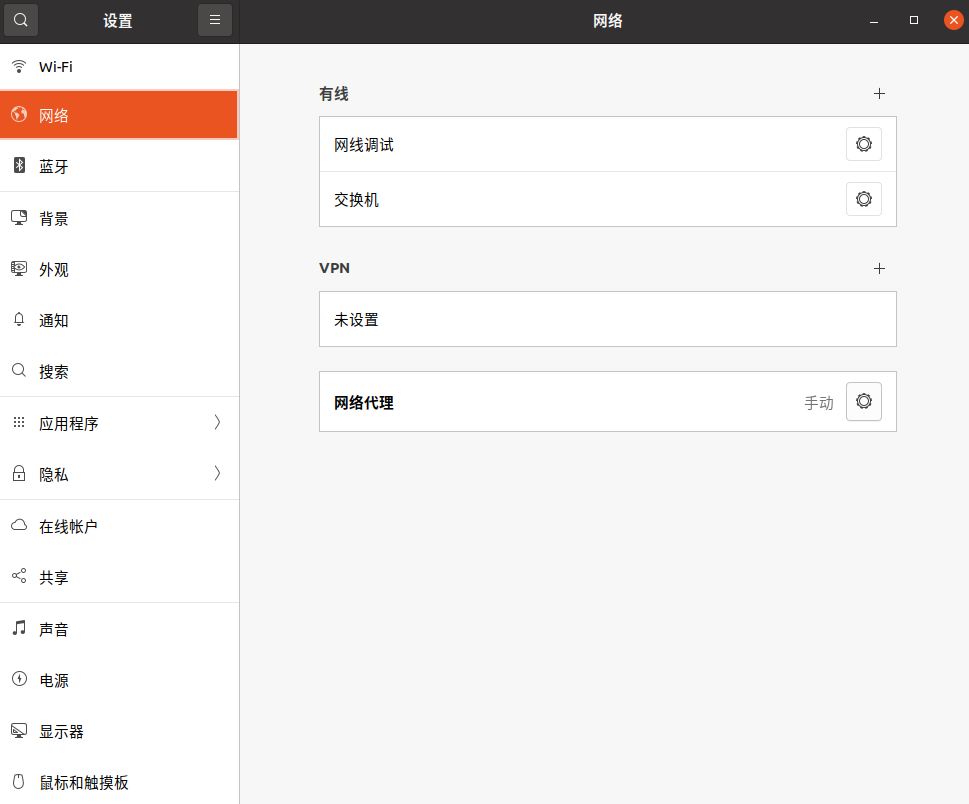
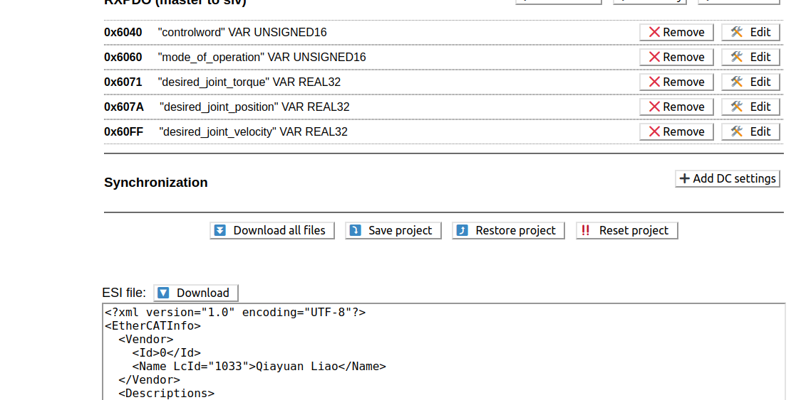
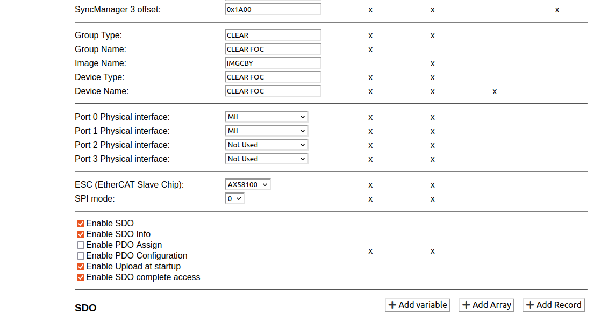
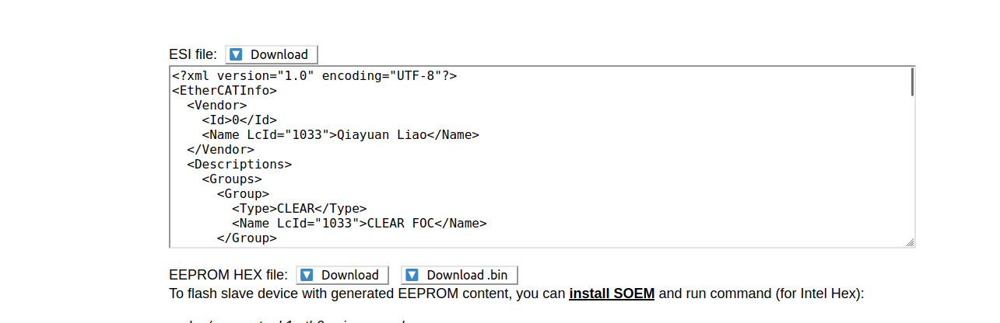
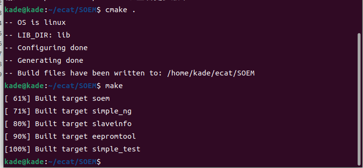
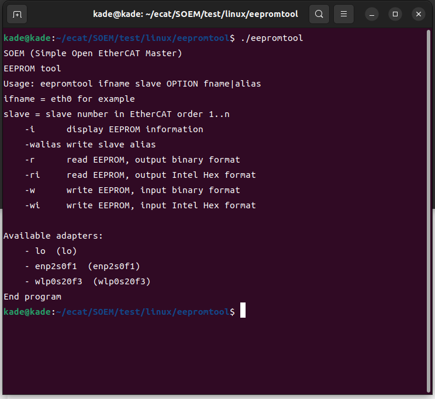
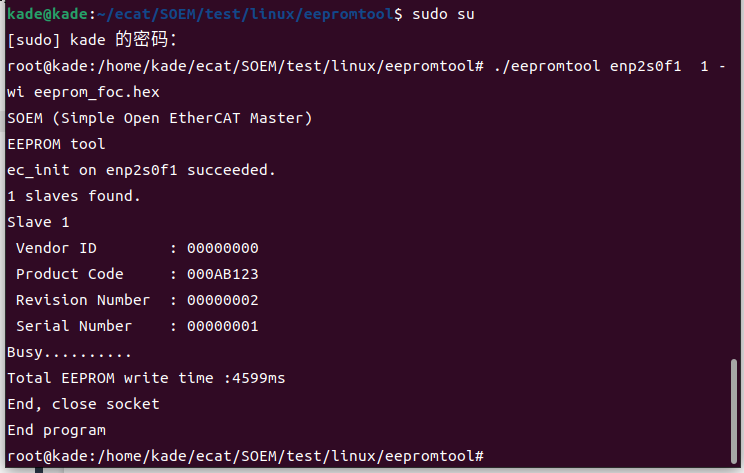

## EtherCAT部署流程

author: 林凯，吴有建

### 软件包安装

首先，我们需要fork以下的包到我们本地仓库

- [rm_ecat](https://github.com/gdut-dynamic-x/rm_ecat)
- [soem_interface](https://github.com/qiayuanl/soem_interface)
- [ecat_manager](https://github.com/gdut-dynamic-x/ecat_manager)
- [any_node](https://github.com/ANYbotics/any_node)
- [message_logger](https://github.com/ANYbotics/message_logger)

同时，我们还需要安装一个依赖

```bash
sudo apt-get install ros-noetic-ethercat-grant
```

先在本地编译通过，再部署到车上。


==编译期间可能会遇到的问题==

- 编译器编译时没有以C++17形式编译，出现报错

​		如：error: ‘string_view’ in namespace ‘std’ does not name a type

```
# 编译时添加编译类型
catkin build -DCMAKE_CXX_STANDARD=17
```

- 找不到依赖的库

   	如：soem_interface，ethercat-grant等

```
请确保这些软件包已经编译，或者以二进制文件形式从源码安装
```


### eeprom的烧录

我们可以按以下步骤来一步步操作。

#### 连接 ethercat

​	如果在之前电脑没有连接过 ethercat，需要配置一下网口才能连接
ethercat。首先要给你的电脑网口分配一个固定的 ip, 打开自己电脑的网
络设置页面，如下图：



​	然后点击有线设置旁边的加号，添加一个新的配置。将 IPV4 改为手动，
并手动设置其地址和网关为 192.168.100.1，子网掩码设置为 255.255.255.0，
将 IPV6 的配置为与其他计算机共享，其他设置默认即可。然后接上网线，
就可以连接上 ethercat 了。

#### Clone 对应的仓库

- [SOEM](https://github.com/OpenEtherCATsociety/SOEM)
- [rm_ecat_fw](https://github.com/gdut-dynamic-x/rm_ecat_fw)

#### 生成 hex 文件

​	到自动生成烧录 eeprom 所需文件的网站上，[点击这里](https://kubabuda.github.io/EEPROM_generator/)或是复制下面的

链接到浏览器(https://kubabuda.github.io/EEPROM_generator/)
	进入网站后，如果需要从零开始配置，那请按部就班地来。这里就不详
细介绍了，毕竟现在的我们是已经有现成的文件了。下面介绍如何使用我们
现有.json 文件，生成 hex 文件。

- 在网站中找到“Restore project”这个选项。



- 点击“Restore project”，进入选择文件夹的界面，如果选择烧录现在车
  上使用的 ethercat 代码，请选择“rm_ecat_fw/drivers/ecat/rm”中的
  esi.json 文件。如果使用 foc，请选择“rm_ecat_fw/drivers/ecat/foc”
  中的 esi.json。
- 在确定选好文件之后。简单地配置一下网站的内容, 其他与数据有关的
  东西如果没有特殊需求，不需要改动。但是下图的勾选请严格按照要
  求来，请将下列的选项 √ 上, 否则 eeprom 的烧录会出问题的。

​		– Enable SDO
​		– Enable SDO info
​		– Enable Upload at startup
​		– Enable SDO complete access



- 配置好后，就可以生成 hex 文件进行烧录. 找到“EEPROM HEX file”：
  点击 DownLoad，即可下载 hex 文件。



#### 构建 eepromtool

- 到（https://github.com/OpenEtherCATsociety/SOEM）clone 下来的
  主目录中, 键入命令编译生成对应的可执行文件, 如果出现以下界面就算是
  成功了。

```
cd /xxx/SOEM
cmake .
make
```



- 到 SOME/test/linux/eepromtool（linux 系统）中，执行 eepromtool
  可执行文件。执行后如图6, 会跳出一些提示。可以看到使用这个脚本
  烧录 eeprom 的命令格式为：

  ```
  eepromtool ifname slave OPTION fame|alias
  ```

  – ifname：要烧录的设备的名称，在这里已经见网口的设备都列出
  来了，有 lo，enp2s0f1,wlp0s20f3 这三个设备。我们 ethercat 的
  设备名为 enp2s0f1。
  – slave: 为连接的从机的数量
  – OPTION: 在这里我们选择 -wi, 表示为已 16 进制的格式写入
  eeprom。
  – fame|alias: 为所要写入的文件。有一点没有提到，就是我们可以
  将在第二部 Download 下来的 hex 文件拷贝到 eepromtool 这个
  目录下，同时也注意这个 hex 文件的命名不要有什么花里胡哨的

  字符，中规中矩的使用英文加下滑线就行。在这里，我烧录的是
  hex 文件是 eeprom_foc.hex。

- 在使用上述命名烧录之前，需要 sudo su 一下，在 root 权限。在此需要烧录的设备为一台从机，烧录的文件格式为 hex 文件，所以总的命令是：

```
sudo su
source /xxx/.bashrc
./eepromtool enp2s0f1 1 −wi eeprom_foc.hex
```



- 如果出现以下界面，就表示成功烧录了。

