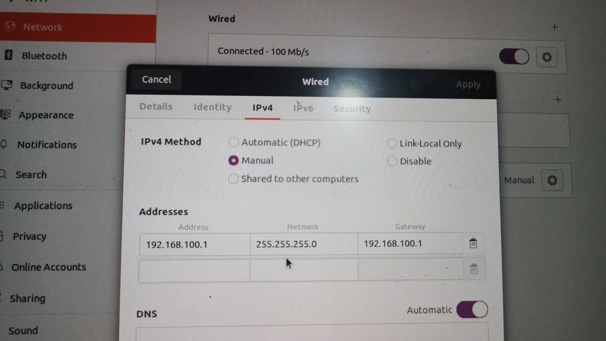

### EtherCat 基本配置与基本使用

> EtherCat用的以太网通信协议，故当配置EtherCat时要给它分配一个静态网关ip


#### 车上的pc连接EtherCat时，按照以下步骤来操作

```
cd /etc/netplan
sudo vim 00-installer-config.yaml(类似的名字)
```

```
# This is the network config written by 'subiquity'
network:
  ethernets:
    enp89s0:                          #接上EtherCat网口的名字
      dhcp4: false
      optional: true
      addresses: [192.168.100.3/24]
      optional: true
      nameservers:
         addresses: [255.255.255.0]
  version: 2
```


#### 自己的电脑连接EtherCat时，按照以下步骤来操作

- 将EtherCat连接自己的电脑
- 将自己的网络设置中的IPV4设置如下




#### EtherCat的基本使用

先将ethercat的相关代码拉到本地编译，代码可以放到rm_ws/src下

- [soem_interface](https://github.com/leggedrobotics/soem_interface)
- [message_logger](https://github.com/ANYbotics/message_logger)
- [any_node](https://github.com/ANYbotics/any_node)
- [rm_ecat](https://github.com/gdut-dynamic-x/rm_ecat)

> 开程序前，要先在bashrc里添加一句 export HW_NAME=rm_ecat_hw
>
> 如果接的是usb2can，就改为export HW_NAME=rm_can_hw

```
sudo apt-get install sudo apt-get install ros-noetic-ethercat-grant
mon launch rm_config rm_ecat_hw.launch
```

