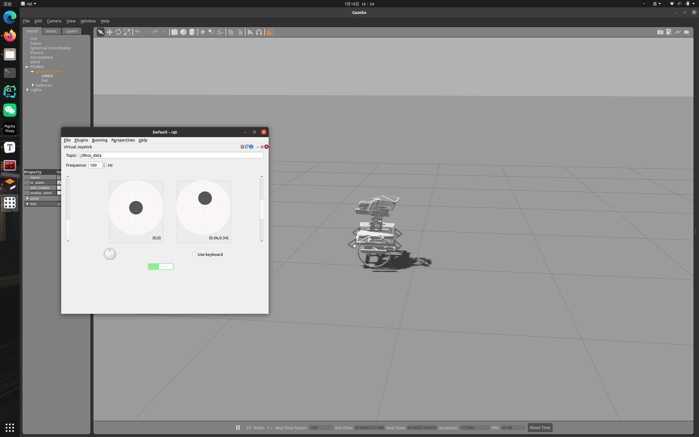

# 从零开始部署平衡开发环境和仿真

本文将带你配置一个平衡步兵专属的工作空间，并将其加载到gazebo中进行仿真模拟。环境与依赖：

- Ubuntu
- [ROS](http://wiki.ros.org/)
- [ocs2](https://github.com/leggedrobotics/ocs2)
- [rm-control & rm-controllers](https://github.com/rm-controls)
- [catkin-tools](https://dynamic-x-docs.netlify.app/quick_start/quick_start_in_control_group.html#catkin-tools)
- [rosmon](https://github.com/rapyuta-robotics/rosmon)

上述依赖中，除了ocs2外，其余的依赖均有详细的官方安装教程，在此不过多赘述。

### 开发环境

> 由于⼀些依赖的 ROS Package（比如这里的ocs2) 只需要当为依赖编译⼀次后就不再改动，因此我们可以把
> 它放在另⼀个⼯作空间当成软件依赖源，与我们需要开发的 Package 在⼯作空间上分离。

##### 依赖树的概念

> 在catkin build时，会将当前的环境中的ROS_PACKAGE_PATH所有路径作为依赖路径，在编译时会在这些依赖路径中寻找对应的依赖，那么下次再编译其他包时，==只需要source一个工作空间，就可以做到source所有的依赖路径了==

首先创建两个工作空间，并初始化

```
mkdir -p depend_ws/src && cd depend_ws/src && catkin_init_workspace
cd ~
mkdir -p balance_ws/src && cd balance_ws/src && catkin_init_workspace 
```

在depend_ws/src下把ocs2拉到本地，在balance_ws/src下把rm_balance拉到本地

```
# 先在平衡步兵工作空间下catkin build
# 看看缺少哪些依赖
```

> ######需要注意的是，只要编译过程中部分包fail或者abandon，那就要catkin clean后再编译
>
> 1. 编译ocs2时会自动从github拉一个包，假如网络不好会出现拉不下来而出现编译超过2-3分钟编译失败的情况（机器人电脑上的解决方法：等到下载完成 or 本地编译好整个工作空间传到机器人上）
> 2. 缺少相应依赖，非ocs2的就用apt安装一下，是ocs2的就去depend_ws里编译对应的包

然后在ocs2的工作空间下设置==instal==l模式，并编译对应的软件包

```
catkin install # 设置 install 模式
catkin config -DCMAKE_BUILD_TYPE=Release

#确保输出没有依赖到balance_ws下的包路径，否则会造成循环依赖
echo ${ROS_PACKAGE_PATH}

catkin build <Dependent_ROS_Package> 
```

接着回到balance_ws下编译软件包，编译 catkin_ws 下包时，保证 ${ROS_PACKAGE_PATH} 里面为
/home/kook/depend_ws/install/share:/opt/ros/noetic/share

> ==值得提出的是，如果你在编译ocs2时有source过~/rm_ws/devel/setup.bash，那么这里的ROS_PACKAGE_PATH还会包含rm_ws下对应包的路径==

```
cd ./balance_ws/src
source ../depend_ws/install/setup.bash

#检查ROS_PACKAGE_PATH
echo ${ROS_PACKAGE_PATH}

catkin build <Package_In_catkin_ws>

# 使⽤ catkin_ws 下的包时，记得 source ~/catkin_ws/devel/setup.bash
# clion project config
-DCATKIN_DEVEL_PREFIX=../devel
```

> 缺哪个包就要到ocs2工作空间下编译哪个包，回到balance_ws下编译时，记得先source depend_ws/install/setup.bash（根据依赖树的概念，如果你在操作上述步骤的前提下，都是在souce ~/rm_ws/devel/setup.bash的前提下，那么这里只需要source ~/rm_ws/devel/setup.bash）

> ==这里最好用rm->depend->balance的依赖关系==

### 在仿真中测试

队内写了一个rqt_virtual_dbus

将其拉到本地rm_ws/src下并编译，使用add_functions分支

[rqt_virtual_dbus](https://github.com/chenhuiYu00/rqt_virtual_dbus/tree/add_functions)

```
git clone git@github.com:chenhuiYu00/rqt_virtual_dbus.git
```

将环境变量中的ROBOT_TYPE改为balance2

```
roscore

mon launch rm_gazebo empty_world.launch 

mon launch rm_config manual.launch balance:=true

# 打开rqt，并在Robot Tools下找到rqt_visual_dbus就可以愉快的玩耍啦
rqt
```



