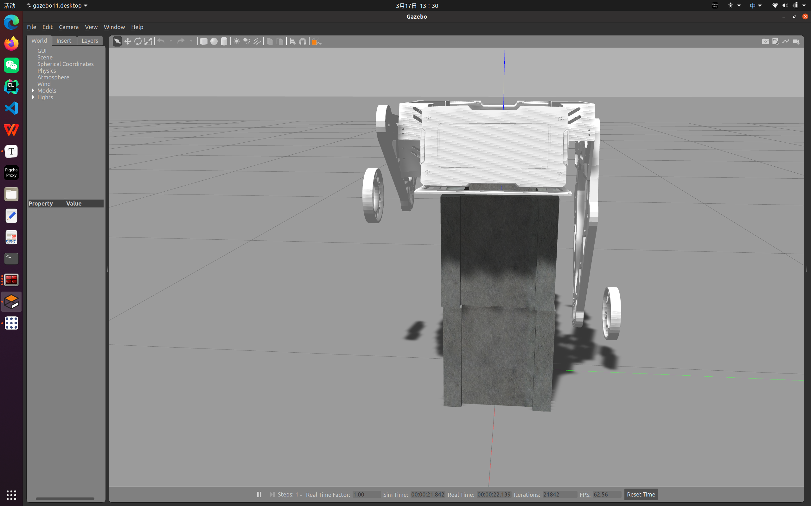
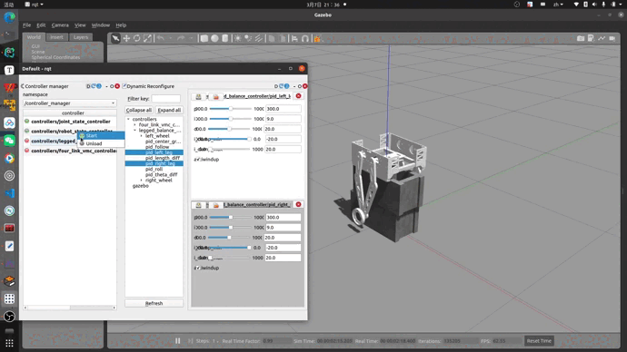

# 调试

由于轮腿的参数较多，当拿到一台新车时，我们可以按照以下步骤去一步步调参


## 腿长调试

首先找一个较高的测试架，将机器人架在上面，检查机器人关节电机的校准方向，设置限位，保证机器人机械结构在调试过程中不会受到损坏。

### 代码

下面是腿长控制的部分代码

```c++
 F_length_diff = pidLengthDiff_.computeCommand(legLength(0) - legLength(1), period);
 scalar_t legAve = (legLength(0) + legLength(1)) / 2;

    F_leg(0) = pidLeftLeg_.computeCommand(balanceInterface_->getLeggedBalanceControlCmd()->getLegCmd() - legAve, period) - F_length_diff;
    F_leg(1) = pidRightLeg_.computeCommand(balanceInterface_->getLeggedBalanceControlCmd()->getLegCmd() - legAve, period) + F_length_diff;
```

细读代码，发现腿长控制是保证两条腿的长度接近腿长的均值，

### 可能会出现的问题

- 一边腿长，一边腿短，发送对应的腿长命令，却没有到达预期位置附近

  

- 给某个腿长命令时，两腿突然往下一蹬，撞击软限位

- 给某个腿长命令时，两条腿剧烈晃动，有一条甚至会一个方向撞去


### 调参数过程

关于腿长控制部分的代码里，具体有以下几个PID参数

```
- pid_left_leg
- pid_right_leg
- pid_theta_diff (两条腿的theta的差分前馈，防止腿劈叉)
- pid_length_diff (两条腿的长度的差分前馈，防止腿长不同)
```

调节腿长，可以先不动原来腿长PID参数，或者给个粗略值

```yaml
    pid_left_leg: { p: 480.0, i: 5.0, d: 20, i_clamp_max: 20.0, i_clamp_min: -20.0, antiwindup: true, publish_state: true }
    pid_right_leg: { p: 480.0, i: 5.0, d: 20, i_clamp_max: 20.0, i_clamp_min: -20.0, antiwindup: true, publish_state: true }
    pid_theta_diff: { p: 40.0, i: 0.0, d: 0.1, i_max: 0.0, i_min: 0.0, antiwindup: true, publish_state: true }
    pid_length_diff: { p: 30.0, i: 0, d: 0, i_clamp_max: 0.0, i_clamp_min: -0.0, antiwindup: true, publish_state: true }
```

然后将Q，R矩阵设置如下

```c++
; state weight matrix
Q
{
  scaling 1e+1

  (0,0) 0.0      ; px
  (1,1) 30.0   ; theta_l
  (2,2) 30.0   ; theta_r
  (3,3) 2000.0   ; theta  # 必要的参数，模型不知道你架起来了，要先给theta较大的权重，计算结果才会正常
  (4,4) 0.0    ; psi
  (5,5) 0.0    ; px_dot
  (6,6) 5.0   ; theta_l_dot
  (7,7) 5.0   ; theta_r_dot
  (8,8) 0.0      ; theta_dot
  (9,9) 0.0      ; psi_dot
}

; control weight matrix
R
{
  scaling 1e-0

  (0,0)  200  ; torque #尽量少改，对系统影响很大，可微调
  (1,1)  200  ; torque
  (2,2)  200  ; torque
  (3,3)  200  ; torque
}
```

不断修改 theta_l，theta_r的权重，使得两条腿能够在固定腿长的情况下，微微摆动，或者几乎不摆动，逐渐解决稳态，同时观察/hip_joint_force，看看mpc算出来的肩关节的力是否过大。



如果摆动幅度很大，不管如何调整参数都不起作用，请检测一下拟合模型的参数数值或者数量级是否符合正确（是否符合常理...）

然后再调节腿长的PID，给腿发布不同的腿长命令，观察腿长PID的输出(output)和误差(error)，调整腿长PID，直到任意腿长变化都较为丝滑，此过程可以将前馈PID全部置0，先调好腿长，再加入前馈细调。


## 起立运动调试

如果腿长调的没问题的话，那么这时候就可以下地了，请保证轮子的减速比正确，以及旋转方向正确，否则起立可能就会变成"蹬地"了，倾倒方向要与轮旋转的方向一致

```
; state weight matrix
Q
{
  scaling 1e+1

  (0,0) 0.0      ; px
  (1,1) 30.0   ; theta_l
  (2,2) 30.0   ; theta_r
  (3,3) 2000.0   ; theta 
  (4,4) 500.0    ; psi  
  (5,5) 300.0    ; px_dot
  (6,6) 5.0   ; theta_l_dot
  (7,7) 5.0   ; theta_r_dot
  (8,8) 0.0      ; theta_dot
  (9,9) 25.0      ; psi_dot 
}

```

- psi   如果溜车的方向不是直线，而是拐弯式溜车，先检查轮子的阻力是否不均，如果正常，

  ​        需要调节这个权重到不拐弯溜车。

- px_dot  水平速度的微分。调节的是轮腿的直线运动，如果超调的话，可以稍微调大一点
- psi_dot  转弯速度的微分。如果转弯超调的话，可以稍微调大一点

