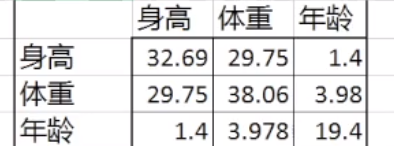

## 卡尔曼滤波器

### 介绍

[卡尔曼滤波器(kalman filter)](https://www.bilibili.com/video/BV1jK4y1U78V/?spm_id_from=333.788&vd_source=042625a233c63373bf208d30bb3aab8e)是一种最优化的递归数字处理算法，它更像是一种观测器，而不是一种一般意义上的滤波器，它的核心算法就是递归算法。

使用卡尔曼滤波的是因为真实世界具有不确定性：

- 不存在完美的数学模型
- 系统的扰动不可控，也很难建模来模拟（系统噪声）
- 测量传感器存在误差（测量噪声）


### 数学概念

- **协方差矩阵(covariance matrix)**

```c
方差，协方差在一个矩阵中体现出来，体现变量中的联动关系，如下图就是一个关于三名运动员的协方差矩阵
其中对应的方差越大，那么说明这两个变量之间的关系越明显
```



- **方差(variance)**

```c
标准差的平方，标准差和方差越大，说明数据偏差越大，噪声越大
```

- **标准差 (standard deviation)**

```c
标准差是一组数据平均值分散程度的一种度量。一个较大的标准差，代表大部分数值和其平均值之间差异较大；一个较小的标准差，代表这些数值较接近平均值。
```

- **单位矩阵(identity matrix)**


### 原理

> 采用了数据融合的思想(Data Fushion)

```c
符号说明：
- x_hat 估计状态量
- x 实际状态量 
- z 测量状态量
- u 控制量 
- A,B 状态矩阵
- I 单位矩阵
- H 状态测量矩阵
- K 卡尔曼增益（kalman gain）
- P 先验误差协方差矩阵
- Q 模型误差协方差矩阵（对角线才有值，其余均为0，反应的是状态量的噪声程度）
- R 测量误差协方差矩阵（对角线才有值，其余均为0，反应的是测量值的噪声程度）
```

卡尔曼滤波可以分为两个部分，预测和校正（更新）：

- **预测部分**

$$
\begin{equation}
\begin{gathered}
先验: \quad \hat{x}_k^{-}=A \hat{x}_{k-1}+B \hat{u}_{k-1} \newline
先验误差协方差:  P_k^{-}=A P_{k-1} A^{\top}+Q
\end{gathered}
\end{equation}
$$

- **校正部分（更新部分）**：

$$
\begin{equation}
\begin{gathered}
卡尔曼增益：K_k=\frac{P_k^{-} H^{\top}}{H P_k^{-} H^{\top}+R} \\
后验估计：\hat{X}_k=\hat{x}_k^{-}+k_k\left(z_k-H \hat{x}_k^{-}\right) \\
更新误差协方差：\quad P_k=\left(I-k_k H\right) P_k^{-}
\end{gathered}
\end{equation}
$$

```c
先验指的是不考虑模型误差，通过已经有的模型和上一时刻的状态量和控制量来直接计算目前状态量
后验指的是通过卡尔曼核心公式求得对应的kalman gain后，重新计算目前状态值
然后不断更新预测状态量与实际状态量的误差矩阵(P)，不断地迭代
```

```c
开始时，需要先给卡尔曼滤波器提供系统模型，初始值，Q，R，H，然后就可以实现迭代了
```


### 代码实现

```c++
  void predict(const Eigen::MatrixBase<T1>& u, const Eigen::MatrixBase<T2>& Q)
  {
    if (!inited)
      return;  // TODO: add assert
    // update Q_
    Q_ = Q;
    // predict
    x_ = A_ * x_ + B_ * u; //先验
    P_new_ = A_ * P_ * A_.transpose() + Q_; //先验误差协方差
  }
```

```c++
  void update(const Eigen::MatrixBase<T1>& z, const Eigen::MatrixBase<T2>& R)
  {
    if (!inited)
      return;  // TODO: add assert
    // update R_
    R_ = R;
    // update
    //卡尔曼增益
    K_ = P_new_ * H_.transpose() * ((H_ * P_new_ * H_.transpose() + R_).inverse()); 
    x_ = x_ + K_ * (z - H_ * x_); //后验估计
    P_ = (I_ - K_ * H_) * P_new_; //更新误差协方差
  };
```


### 拓展卡尔曼滤波器(ekf)

对于一个线性系统来说，w，k均是偏差，且符合正态分布
$$
\begin{equation}
\begin{array}{ll}
X_k=A x_{k-1}+B u_{k-1}+w_{k-1} & P(w) \sim N(0, Q) \\
Z_k=H_{k-1}+V_k & P(v) \simeq N(0, R)
\end{array}
\end{equation}
$$
kalman filter是一个最优的线性系统滤波器，考虑到还有非线性模型的存在，经过非线性模型的映射，原来呈现正态分布的误差不再是正态的，所以我们不能再用线性的方法去处理。故对于非线性系统来说
$$
\begin{equation}
\begin{aligned}
& x_k=f\left(x_{k-1}, \mu_{k-1}, w_{k-1}\right) \quad f, h \text { 非线性 } \\
& z_k=h\left(x_k, v_k\right)
\end{aligned}
\end{equation}
$$
解决方法是，我们在某一个**工作点**(operating point)对这个系统进行线性化，这样就可以继续用线性的表达式了。但是系统有误差，不能在当前真实点进行线性化，故只能找上一次的点作为工作点。对于一维的系统可以用泰勒展开去近似：
$$
\begin{equation}
f(x)=f\left(x_0\right)+\frac{\partial f}{\partial x}\left(x-x_0\right)
\end{equation}
$$
对于高维的系统可以用**雅可比矩阵**去近似：
$$
\begin{equation}
\left[\begin{array}{ll}
\frac{\partial f_1}{\partial x_1} & \frac{\partial f_1}{\partial x_2} \\
\frac{\partial f_2}{\partial x_1} & \frac{\partial f_2}{\partial x_2}
\end{array}\right]
\end{equation}
$$

$$
\begin{equation}
x_k=f\left(\hat{x}_{k-1}, \mu_{k-1}, \omega_{k-1}\right)+A\left(x_k-\hat{x}_{k-1}\right)+w_k w_{k-1}
\end{equation}
$$

其中A为雅可比矩阵，且随k的变化而变化，最后可以推出extended kalman filter的核心表达式
$$
\begin{array}
{l}X_{k} = \tilde{X}_{k}+A\left(X_{k-1}-\hat{X}_{k-1}\right)+Ww_{k-1} & P(w) \sim N(0, wQw^{\top}) \\
Z_{k} = \tilde{Z}_{k}+H\left(X_{k}-\tilde{X}_{k}\right)+V_{v_{k}}& P(v) \sim N(0, vRv^{\top})
\end{array}
$$

- **预测部分**

$$
\begin{array}{l}
先验: \hat{x}_{k}^{-}=f\left(\hat x_{k-1}, u_{k-1}, 0\right) \\
先验误差协方差: P_{k}^{-}=A P_{k-1} A^{\top}+w Q w^{\top}
\end{array}
$$

- **校正部分（更新部分）**

$$
\begin{equation}
\begin{gathered}
卡尔曼增益：K_k=\frac{P_k^{-} H^{\top}}{H P_k^{-} H^{\top}+vRv^{\top}} \\
后验估计：\hat{X}_k=\hat{x}_k^{-}+k_k\left(z_k-h\left(\hat x_{k-1}, 0\right)\right) \\
更新误差协方差：\quad P_k=\left(I-k_k H\right) P_k^{-}
\end{gathered}
\end{equation}
$$

更多关于卡尔曼滤波的知识，[请看这里](https://www.bilibili.com/video/BV1jK4y1U78V/?spm_id_from=333.788&vd_source=042625a233c63373bf208d30bb3aab8e)