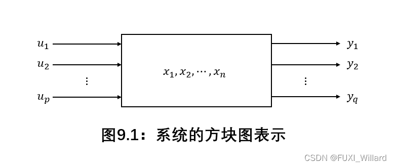
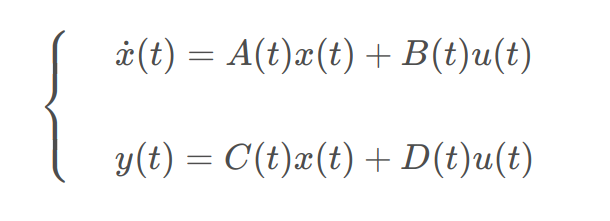

## 现代控制理论

#### 1.[线性系统的状态空间描述](https://blog.csdn.net/qq_39032096/article/details/109609898)

##### 1.1系统数学描述的两种基本类型



- 一种是系统的外部描述，即输入-输出描述；这种描述将系统看作一个"黑箱"，只是反映系统外部变量间即输入-输出间的因果关系，而不去表征系统的内部结构和内部变量；
- 另一种是系统的内部描述，即状态空间描述；这种描述基于系统内部结构分析的一类数学模型，通常由两个数学方程组成。一个是描述==系统输入u==和==系统状态x==之间的因果关系的微分方程或差分方程，一个是描述==系统的输出y==与==系统输入u和系统状态x==之间的微分方程或差分方程，可以完整的描述系统的==动力学特性==

> 对于经典控制理论来说，其解决的问题就是系统的输入与输出之间的关系，系统的模型通过传递函数（时域微分方程的拉普拉斯变换）来表示，从而研究系统的优化方法

> 对于现代控制理论来说，引入了系统的内部状态，将系统的模型变为状态空间方程（时域微分模型通过状态量化简表示，得到对应的状态方程），更加完整地描述了系统


##### 1.2 系统状态空间描述常用的基本概念

- **状态和状态变量：**系统在时间域中的行为或运动信息的集合称为状态；确定系统状态的一组独立变量称为状态变量
- **状态向量：**把描述系统状态的n个状态变量作为状态向量*x*的分量，*x*可以说是状态变量的集合
- **状态空间**：以n个状态变量作为基底所组成的n维空间称为状态空间，也就是说在状态空间中，我们所选取的状态变量必须是相互独立的，才可以线性表达任意的状态量；

- **线性系统的状态空间表达式：**若线性系统描述系统状态量与输入量之间关系的状态方程是一阶向量线性微分方程或一阶向量线性差分方程，而描述输出量与状态量和输入量之间关系的输出方程是向量代数方程，则其组合称为线性系统状态空间表达式，亦称动态方程，其连续形式为：



```c
其中，A，B，C，D为矩阵，均有不同的含义
- A为系统矩阵或状态矩阵；
- B为控制矩阵或输入矩阵；
- C为观测矩阵或输出矩阵；
- D为前馈矩阵或输入输出矩阵；
在使用线性系统的优化方法时，如：lqr，mpc等等，均需要A，B阵来描述系统模型
```


##### 1.3如何得到空间状态方程

- 可以通过拉普拉斯变换得到传递函数，再化简展开的到空间状态方程（不过思路与计算较为繁琐）
- 可以从系统的动力学方程推导得到系统的状态方程，可以参考[这个](https://blog.csdn.net/qq_39032096/article/details/109609898)（计算思路简单）

